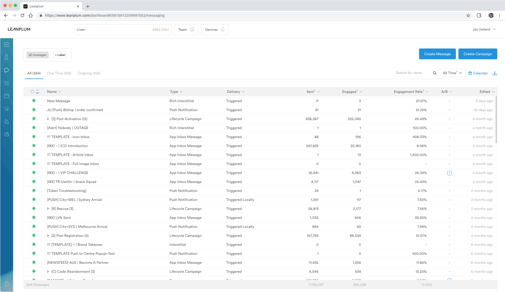
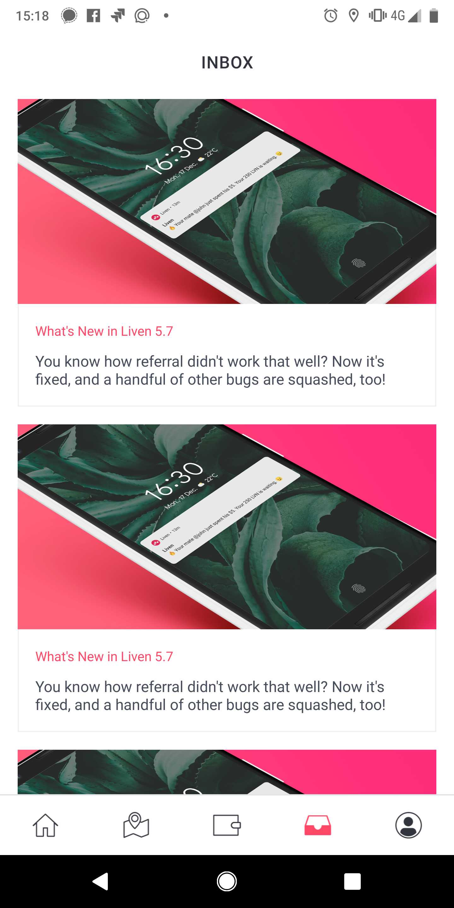
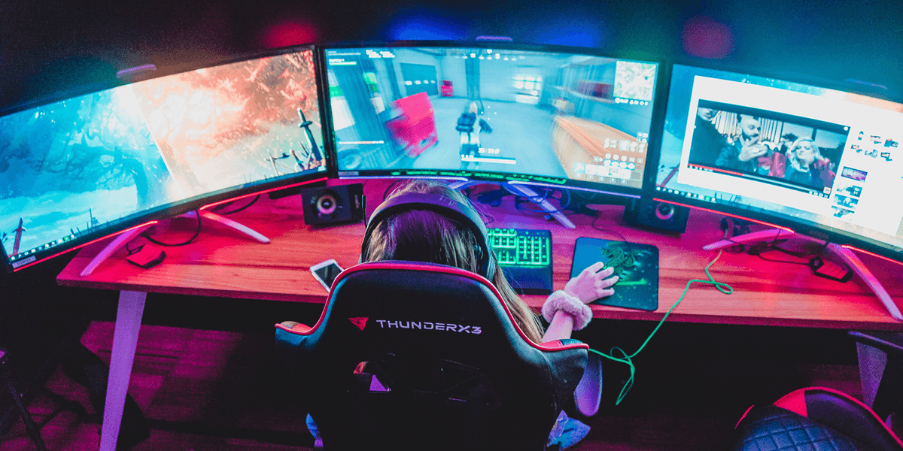

# Training Manual
This is the Liven Training Manual
# Introduction
Lalala here is introduction
## The Liven Brand
information
## What is Liven
information
## Copy Guidelines hahah 
information
## Logo & Brand
information
## Colour Guide
information
# Liven CMS
information
## App Collections
information
## Promo Codes
information
## Frenzy
informati
# App Messaging
information
## Push Messages
push messages

## App Inbox - Icon
information
## App Inbox - Article
Inbox Articles are a common content delivery method we employ for driving affordable eyeballs and traffic to content on our owned platforms, specifically the Liven Blog, and our Medium publication.

*Here's what they look like* 

To get started, log into Leanplum, and open the messaging dashboard, then navigate to a message called !!! TEMPLATE - Article Inbox. In most cases, templates are denoted by Live messages named with !!!

From here, simply create a duplicate message by clicking the context menu, and hitting copy (to the same app you started in)

You should now be in a view of an identical message marked (copy). From here, begin populating content according to the format of the template. For articles, the content requires:

1. PNG Banner image 1200x600
2. Headline copy
3. Subheading copy
4. Link out to blog or content

Here's an example of an image we might use.

**Please note, 2:1 ratio is critical for these images, and start with a high quality image before cropping down.**

Let's fill in the content for this article post for the launch of a merchant.

## App Inbox - FullImage

## Takeovers
information
## Popups
information
# Email
information
## Newsletters
information
## Triggered Mail
information
# Social
information
## Instagram
information
## Facebook
information
##  Twitter
information